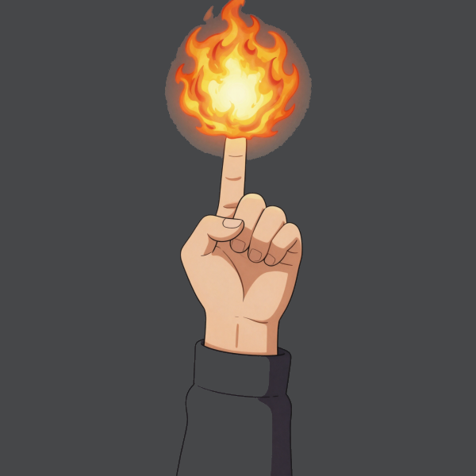
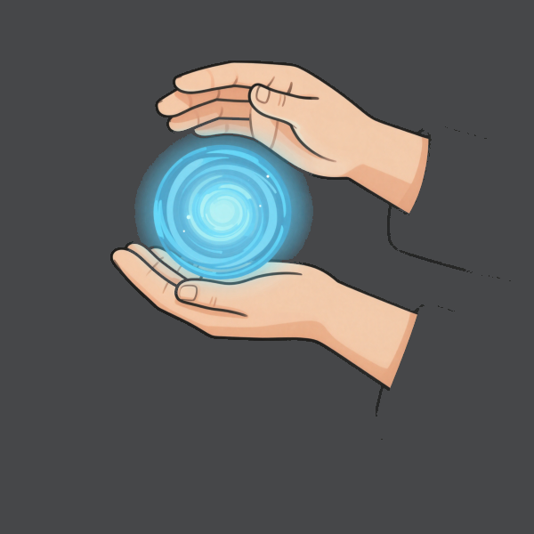
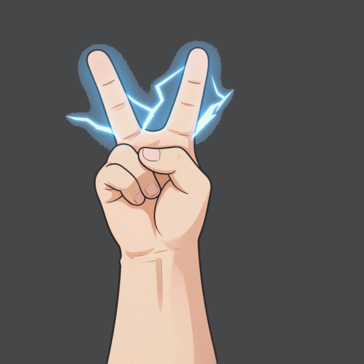
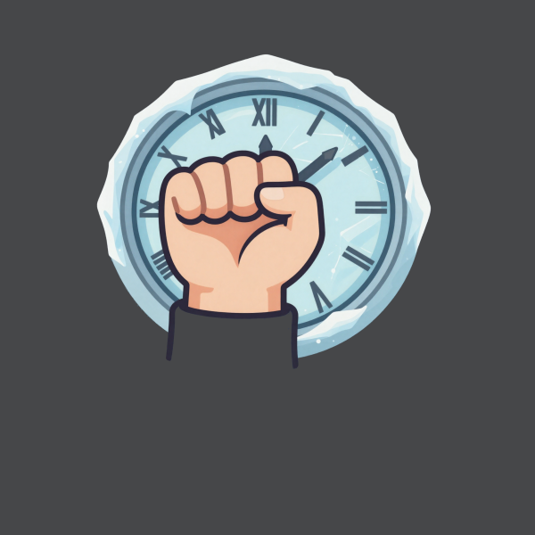
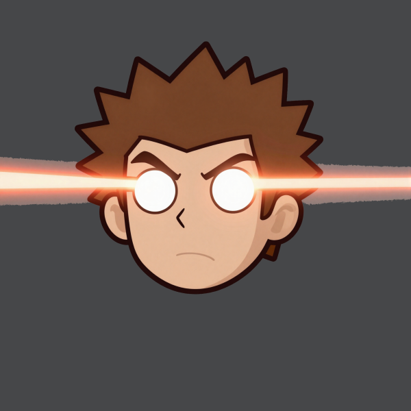
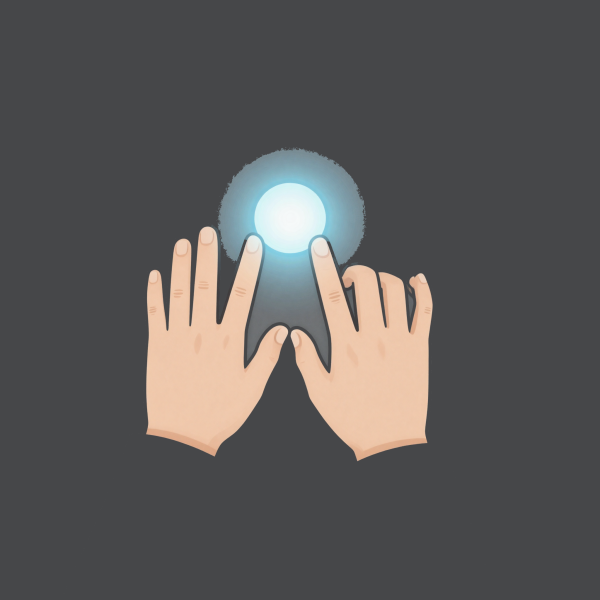
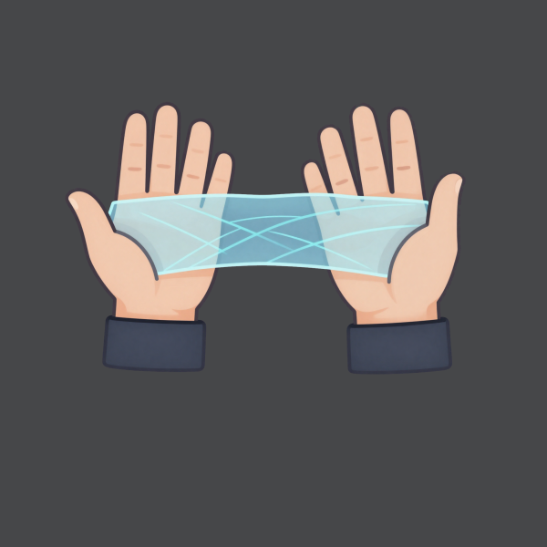
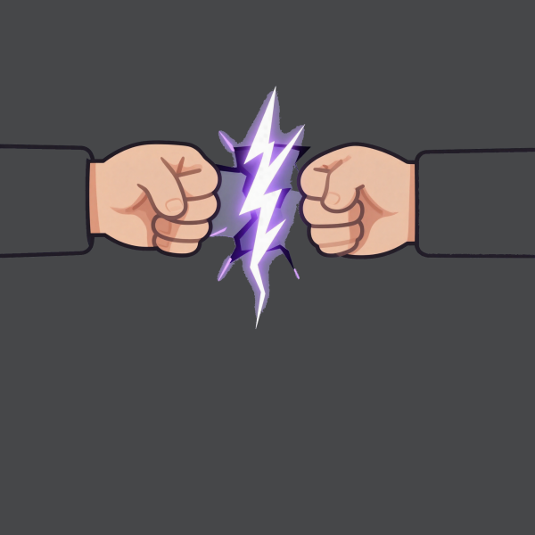
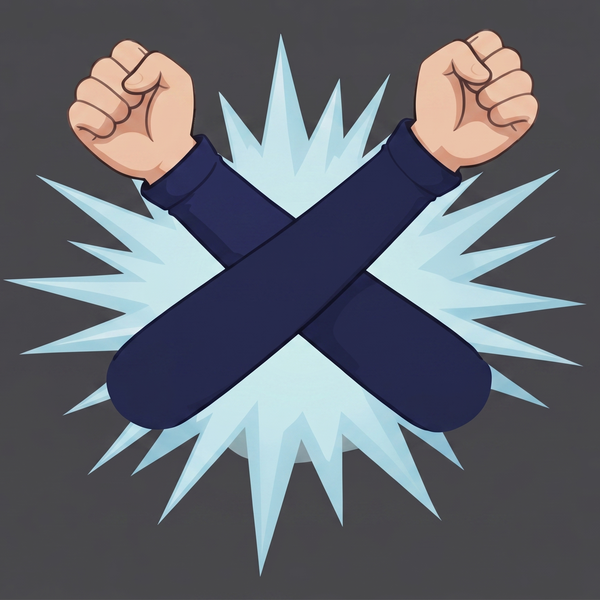

# Conjure — Ability Manual

Hold a hand sign, charge it, then fire.

---

## Controls

| Key | Action |
|-----|--------|
| `Q` | Quit |
| `K` | Show / hide the on-screen controls list |
| `ESC` | Close the manual / controls list when open (does **not** quit) |
| `H` | Toggle minimal HUD |
| `D` | Toggle debug overlay |
| `L` | Toggle Laser Eyes / face tracking on/off |
| `R` | Clear the Laser Eyes molten drawing |
| `S` | Save a screenshot to `./screenshots/` |
| `M` | Open / close this manual (press `ESC` to close) |
| `←` / `→` | Previous / next manual page |

---

## How abilities work

1. **Sign** — hold the hand shape shown below.
2. **Charge** — hold the sign still; the bar and `%` counter climb to 100.
3. **Fire** — perform the release gesture shown under each ability.

**HOLD** abilities stay active while you hold the sign and end when you drop it.

---

## Abilities

### 1 · Fireball

| | |
|---|---|
| **Sign** | One hand — only the INDEX finger pointing up (thumb + other fingers folded) |
| **Charge** | Hold the sign once until charged |
| **Fire** | FLICK THE FINGER to shoot — unlimited shots while the pose is held |

---

### 2 · Rasengan

| | |
|---|---|
| **Sign** | Two hands stacked — lower cupped palm facing UP, the top hand stirs in a circle |
| **Charge** | Stir the top hand to spin the sphere up |
| **Fire** | FLICK to throw — a slow-drifting sphere that bursts at the frame edge |

---

### 3 · Chidori

| | |
|---|---|
| **Sign** | One hand: index + middle fingers up (V sign), ring + pinky folded |
| **Charge** | Hold the sign until charged |
| **Fire** | HOLD (active while held; ends when you drop the sign) |

---

### 4 · Time Freeze

| | |
|---|---|
| **Sign** | One closed FIST, palm facing the camera |
| **Charge** | Hold ~2.5 s as the scene slows |
| **Fire** | HOLD — the scene freezes, then shatters like glass when you drop the fist |

---

### 5 · Laser Eyes

| | |
|---|---|
| **Sign** | Close BOTH eyes — face sign, no hands needed (quick blinks don't count) |
| **Charge** | Hold both eyes shut ~1 s; the rising whine builds — when it ends, your eyes are charged |
| **Fire** | OPEN EYES TO FIRE — twin beams CONVERGE to a single point you aim with your HEAD and EYES together. It starts on your own face and reaches anywhere on screen (no dead zone), melting a trail you can draw/write with — a smiley or "HI". Close your eyes again (~0.25 s) to stop. The drawing stays until you press `R` |

---

### 6 · Kamehameha

| | |
|---|---|
| **Sign** | Two open hands raised together, palms to the camera, index fingertips & thumbs touching to form a triangle/diamond |
| **Charge** | Hold the sign until charged |
| **Fire** | PUSH/SPREAD toward where you AIM — face the cup at the camera to blast the screen (blue engulf), or tilt it to a side to fire the beam that way |

---

### 7 · Space Stretch

| | |
|---|---|
| **Sign** | Two open palms facing each other, then pulled apart |
| **Charge** | None — the warp happens instantly and grows the further you separate your hands |
| **Fire** | HOLD — the space between your hands shears and stretches while you hold the pose; ends when you drop it |

---

### 8 · Reality Tear

| | |
|---|---|
| **Sign** | Two closed FISTS bumped together, then pulled apart |
| **Charge** | Bump the fists together to charge |
| **Fire** | RIP APART — a jagged glowing fracture tears open between your hands |

---

### 9 · Frost Nova

| | |
|---|---|
| **Sign** | Wrists CROSSED in an X |
| **Charge** | Hold the sign until charged |
| **Fire** | SPREAD/OPEN HANDS TO BURST |

---

*Press **M** in-app to view the interactive manual with live diagrams.  Press **ESC** to close the manual overlay.*
